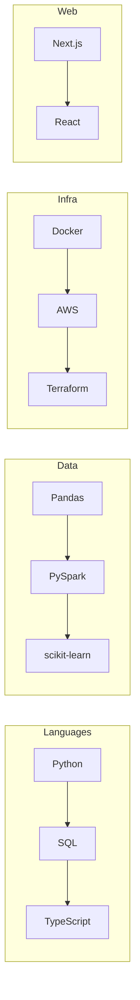

+++
title = "About"
description = "Stephen Adei — Quantitative Analyst & Data Engineer"
date = "2025-03-02"
aliases = ["about-us", "about-me"]
author = "Stephen Adei"
+++

Hi, I'm **Stephen** — I turn messy data into clean systems and actionable insights. Amsterdam-based, MSc Mathematics (2026), and I've been building production data systems for over a decade.

| | |
|---|---|
| **The elevator pitch** | Quantitative Analyst & Data Engineer — Applied quantitative work on real datasets; production data systems & finance-grade architecture. Strong communication (15+ years STEM education). Bilingual (EN/NL). |
| **The nerdy bits** | Python, SQL, TypeScript · Pandas, PySpark, scikit-learn · AWS S3, Docker, Terraform, CI/CD · Next.js, React, REST APIs · Statistical modeling (GLM, mixed-effects, time series) · ETL pipelines, data governance. |
| **In short** | Math → models → systems → insights. I like things that scale and docs that don't lie. |

---

## What I do

| By day | By night |
|--------|----------|
| Data pipelines, APIs, and platform architecture | MSc thesis: *Entanglement-assisted zero-error communication* (quantum info theory) |
| Stephen's Privélessen — production systems for exam training at scale | Teaching mathematics & STEM (VMBO → VWO) |
| Finance-grade data platform design ([ohpen.stephenadei.nl](https://ohpen.stephenadei.nl)) | Helping students with stats, ML, and reproducible workflows |

---

## Stack at a glance

---

## Background

- **UvA** — MSc Mathematics (Quantum Informatics & Dynamical Systems), expected 2026
- **UvA (SOWISO)** — Developed online math modules (basic skills, Analysis 1)
- **Lyceo** — Exam trainer & content guide (2015–2021)
- **Stephen's Privélessen** — Own practice since 2010: tutoring, platform, and data systems

Reach out via [Contact](/contact/) or the links below. 👇
